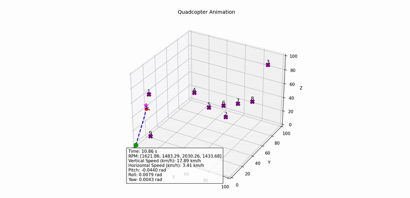
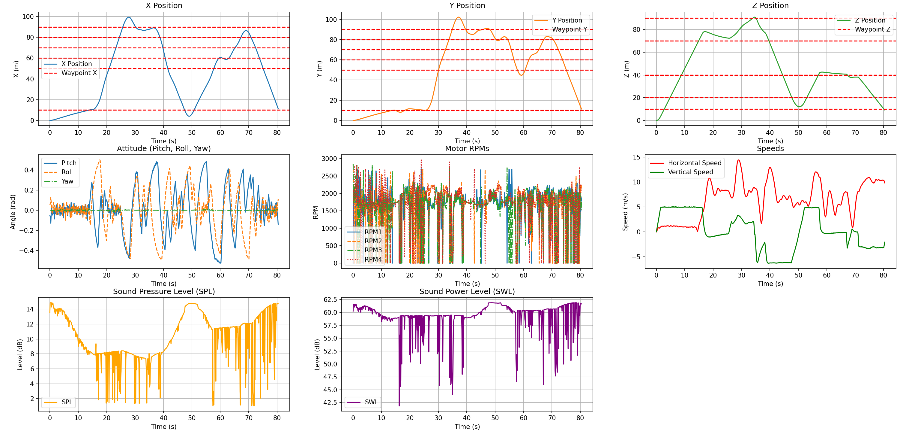

# Advanced Drone Controller Optimization

<p align="center">
  
  
</p>

## Overview
This project simulates a quadcopter and optimizes its cascade PID controller. The simulation includes:

- A neural-network rotor model
- An acoustic noise model
- An optional Dryden turbulence model

Several optimization strategies are provided:

- Bayesian Optimization
- Particle Swarm Optimization
- Genetic Algorithm
- Soft Actor–Critic (SAC)
- Twin–Delayed DDPG (TD3)

## Installation
```bash
git clone https://github.com/andrea-vaiuso/Advanced-Drone-Controller-Optimization.git
cd Advanced-Drone-Controller-Optimization
pip install -r requirements.txt
```

Configuration files are stored in the `Settings/` directory. Edit these YAML files to adjust simulation and optimization parameters.

## Usage
Run a basic simulation with default gains:
```bash
python main.py
```

PID tuning examples:
```bash
python pid_optimization_bayopt.py  # Bayesian optimization
python pid_optimization_pso.py     # Particle Swarm Optimization
python pid_optimization_ga.py      # Genetic Algorithm
python pid_optimization_sac.py     # Soft Actor–Critic
python pid_optimization_td3.py     # Twin–Delayed DDPG
```

A simple GUI for world editing is also available:
```bash
python world_creation_gui.py
```

## Drone Physics
The drone is modeled as a rigid body of mass $m$ with inertia matrix $\mathbf{I}$. The translational dynamics are:

$$
 m\ddot{\mathbf{p}} = \mathbf{R}(\phi,\theta,\psi)\begin{bmatrix}0 \\ 0 \\ T\end{bmatrix} - m\mathbf{g} - \mathbf{C_d}\dot{\mathbf{p}},
$$

where:
- $\mathbf{R}$: rotation matrix (body to world frame)
- $T$: total thrust
- $\mathbf{g}$: gravity
- $\mathbf{C_d}$: drag coefficients

Rotational dynamics:

$$
\mathbf{I}\dot{\boldsymbol{\omega}} = \boldsymbol{\tau} - \boldsymbol{\omega} \times (\mathbf{I}\boldsymbol{\omega}) - \mathbf{C_a}\,|\boldsymbol{\omega}| \circ \boldsymbol{\omega},
$$

where:
- $\boldsymbol{\omega}$: body rates
- $\boldsymbol{\tau}$: motor torques
- $\mathbf{C_a}$: aerodynamic friction

Rotor thrusts and torques are produced by a neural network trained on blade element momentum theory data.

## PID Cascade Scheme
The controller is composed of cascaded PID loops, with the general PID law:

$$
u(t) = K_P e(t) + K_I \int_0^t e(\tau)\,d\tau + K_D \frac{d e}{dt}.
$$

Cascade control stages:

1. **Position** → $(v_x, v_y, v_z)$ (desired velocities)
2. **Speed** → $(\phi, \theta)$ (desired angles), $T$ (desired thrust)
3. **Attitude** → track roll/pitch; separate PID for yaw

Anti-windup and output saturation are applied based on physical constraints.

## Wind Model
Turbulence is simulated using the Dryden spectral model. For the horizontal component $u$:

$$
G_u(s) = \sigma_u \sqrt{\frac{2L_u}{\pi V}} \cdot \frac{V}{sL_u + V},
$$

where:
- $L_u$: turbulence scale length
- $V$: airspeed
- $\sigma_u$: wind speed standard deviation

Similar transfer functions are used for lateral and vertical turbulence. White-noise is filtered to generate wind histories.

## Acoustic Noise Model
Rotor noise is predicted with a data-driven model. For each rotor:

- Sound power level $\mathrm{SWL}_i$ is scaled based on RPM and angle $\zeta = \arctan(h/d)$
- Total sound power:

$$
\mathrm{SWL}_{\text{tot}} = 10\log_{10} \sum_i 10^{\mathrm{SWL}_i / 10},
$$

- Sound pressure at distance $r$:

$$
\mathrm{SPL} = \mathrm{SWL}_{\text{tot}} - 10 \log_{10}(4\pi r^2).
$$

Used as a cost component during optimization.

## Optimization Output
Each optimizer stores logs and plots under:
```
Optimizations/<METHOD>/<timestamp>/
```
Contents include:
- Best parameter set
- Cost trend over iterations

## Project Structure
- `main.py` – simulation entry point
- `Controller.py` – PID cascade controllers
- `Drone.py` – quadcopter dynamics
- `Simulation.py` – simulation loop and noise handling
- `pid_optimization_bayopt.py` – Bayesian optimization
- `pid_optimization_pso.py` – Particle Swarm Optimization
- `pid_optimization_ga.py` – Genetic Algorithm
- `pid_optimization_sac.py` – Soft Actor–Critic
- `pid_optimization_td3.py` – Twin–Delayed DDPG
- `world_creation_gui.py` – optional GUI for world editing