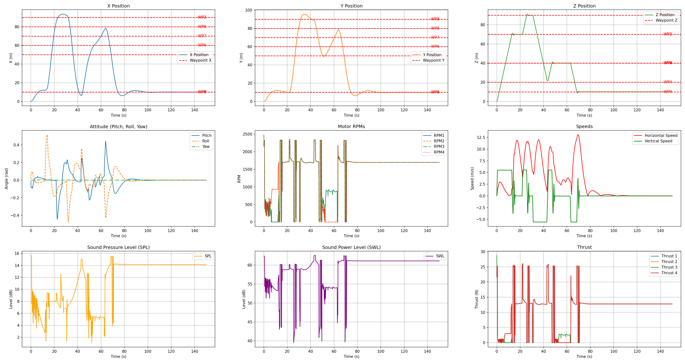

# Advanced Drone Controller Optimization

<div style="display: flex; gap: 10px;">
  
  
</div>

## Overview
This project simulates a quadcopter and optimizes its cascade PID controller.  The
simulation includes a neural‑network rotor model, an acoustic noise model and an
optional Dryden turbulence model.  Several optimization strategies are provided
(Bayesian, Particle Swarm, Genetic Algorithm, SAC and TD3) to tune the controller
parameters for different mission profiles.

## Installation
```bash
git clone https://github.com/andrea-vaiuso/Advanced-Drone-Controller-Optimization.git
cd Advanced-Drone-Controller-Optimization
pip install -r requirements.txt
```
Configuration files are stored in the `Settings/` directory.  Edit these YAML
files to adjust simulation and optimization parameters.

## Usage
Run a basic simulation with default gains
```bash
python main.py
```
PID tuning examples
```bash
python pid_optimization_bayopt.py  # Bayesian optimization
python pid_optimization_pso.py     # Particle Swarm Optimization
python pid_optimization_ga.py      # Genetic Algorithm
python pid_optimization_sac.py     # Soft Actor–Critic
python pid_optimization_td3.py     # Twin–Delayed DDPG
```
A simple GUI for world editing is also available
```bash
python world_creation_gui.py
```

## Drone Physics
The drone is modeled as a rigid body of mass $m$ with inertia matrix $\mathbf{I}$.  The
translational dynamics are
\[
 m\ddot{\mathbf{p}} = \mathbf{R}(\phi,\theta,\psi)\begin{bmatrix}0\\0\\T\end{bmatrix} -m\mathbf{g}-\mathbf{C_d}\dot{\mathbf{p}},
\]
where $\mathbf{R}$ is the rotation matrix from body to world frame, $T$ is the total
thrust, $\mathbf{g}$ is gravity and $\mathbf{C_d}$ contains drag coefficients.  The
rotational dynamics are
\[
\mathbf{I}\dot{\boldsymbol{\omega}}=\boldsymbol{\tau}-\boldsymbol{\omega}\times(\mathbf{I}\boldsymbol{\omega})-\mathbf{C_a}\,|\boldsymbol{\omega}|\circ\boldsymbol{\omega},
\]
with body rates $\boldsymbol{\omega}$, motor torques $\boldsymbol{\tau}$ and aerodynamic
friction $\mathbf{C_a}$.  Rotor thrusts and torques are produced by a neural network
trained on blade element momentum theory data.

## PID Cascade Scheme
The controller is composed of multiple cascaded PID loops.  The generic PID law is
\[
 u(t) = K_P e(t) + K_I \int_0^t e(\tau)\,d\tau + K_D \frac{d e}{dt}.
\]
The cascade operates as follows:
1. **Position** controllers generate desired horizontal velocities $(v_x,v_y)$ and
   vertical speed $v_z$ from position errors.
2. **Speed** controllers convert $(v_x,v_y)$ to desired roll and pitch angles,
   and $v_z$ to a thrust command.
3. **Attitude** controllers track roll and pitch angles, while a dedicated PID
   stabilizes yaw.
Anti‑windup limits each integral term and outputs are saturated according to
physical constraints.

## Wind Model
Turbulence is simulated with the Dryden spectral model.  For the horizontal
component $u$, the transfer function is
\[
G_u(s)=\sigma_u\sqrt{\frac{2L_u}{\pi V}}\frac{V}{sL_u+V},
\]
where $L_u$ is the turbulence scale length, $V$ is airspeed and $\sigma_u$ is the
standard deviation of the wind speed.  Similar second‑order forms are used for
lateral and vertical components.  Random white‑noise sequences are filtered
through these transfer functions to generate time histories of wind velocity.

## Acoustic Noise Model
Rotor noise is predicted by a data‑driven model.  For a single rotor with sound
power level $\mathrm{SWL}_i$ the contribution is scaled with the rotor RPM and the
angle $\zeta = \arctan(h/d)$ between the rotor and an observer at horizontal
range $d$ and altitude difference $h$.  The total sound power level is
\[
\mathrm{SWL}_{\text{tot}}=10\log_{10}\sum_i 10^{\mathrm{SWL}_i/10},
\]
and the sound pressure level at distance $r$ is
\[
\mathrm{SPL}=\mathrm{SWL}_{\text{tot}}-10\log_{10}(4\pi r^2).
\]
These values feed a noise cost term used during optimization.

## Optimization Output
Each optimizer stores logs and plots under `Optimizations/<METHOD>/<timestamp>/`.
Results include the best parameter set and the cost trend across iterations.

## Project Structure
- `main.py` – simulation entry point
- `Controller.py` – PID cascade controllers
- `Drone.py` – quadcopter dynamics
- `Simulation.py` – simulation loop and noise handling
- `pid_optimization_bayopt.py` – Bayesian optimization
- `pid_optimization_pso.py` – Particle Swarm Optimization
- `pid_optimization_ga.py` – Genetic Algorithm (this work)
- `pid_optimization_sac.py` – Soft Actor–Critic tuning
- `pid_optimization_td3.py` – Twin‑Delayed DDPG tuning
- `world_creation_gui.py` – optional world editor

## License
This project is released under the MIT License.
